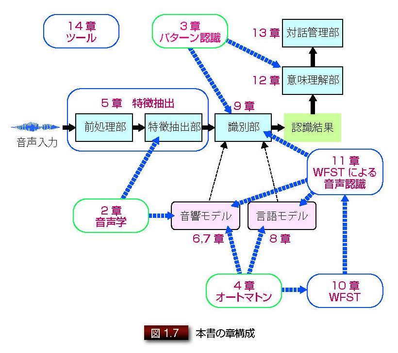

## イラストで学ぶ音声認識

荒木雅弘・著 講談社 2015

ISBN 978-4-06-153824-5

2,600円(税別)

## 本書の構成

## スライド

| 章 | ppt | PDF |
|:-----------|---:|:---:|
| 1. はじめに |  [ppt](ppt/chap01.ppt) |  [pdf](pdf/chap01.pdf) |
| 2. 音声とは | [ppt](ppt/chap02.ppt) |  [pdf](pdf/chap02.pdf) |
| 3. 統計的パターン認識 | [ppt](ppt/chap03.ppt) | [pdf](pdf/chap03.pdf) |
| 4. 有限状態オートマトン | [ppt](ppt/chap04.ppt) | [pdf](pdf/chap04.pdf) |
| 5. 音声からの特徴抽出 | [ppt](ppt/chap05.ppt) | [pdf](pdf/chap05.pdf)  |
| 6. 音声の認識:基本的な音響モデル | [ppt](ppt/chap06.ppt) | [pdf](pdf/chap06.pdf)  |
| 7. 音声の認識:高度な音響モデル | [ppt](ppt/chap07.ppt) | [pdf](pdf/chap07.pdf)  |
| 8. 音声の認識:言語モデル | [ppt](ppt/chap08.ppt)  |[pdf](pdf/chap08.pdf)  |
| 9. 音声の認識:探索アルゴリズム | [ppt](ppt/chap09.ppt) | [pdf](pdf/chap09.pdf)  |
| 10. 音声の認識:WFST の演算 | [ppt](ppt/chap10.ppt) | [pdf](pdf/chap10.pdf)  |
| 11. 音声の認識:WFST による音声認識 | [ppt](ppt/chap11.ppt) | [pdf](pdf/chap11.pdf)  |
| 12. 意味・意図の解析| [ppt](ppt/chap12.ppt)  |[pdf](pdf/chap12.pdf)  |
| 13. 音声対話システムの 実現に向けて | [ppt](ppt/chap13.ppt) | [pdf](pdf/chap13.pdf)  |
| 14. おわりに |  [ppt](ppt/chap14.ppt) | [pdf](pdf/chap14.pdf)  |

### 著作権表示

本サイトで提供されるコンテンツの著作権は、荒木雅弘、（株）講談社にある。

非営利目的に限り、ファイルのダウンロード・印刷・複製を自由に行ってよい。本コンテンツそのものおよび本コンテンツに改変を加えたものを、販売あるいは配布することを禁止する。
