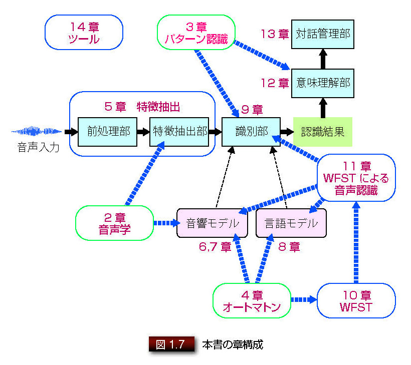

# イラストで学ぶ音声認識

* 著者：荒木雅弘
* 出版社：講談社
* 出版年：2015年
* 出版社の公式ホームページ：[http://www.kspub.co.jp/book/detail/1538245.html](http://www.kspub.co.jp/book/detail/1538245.html)
* 書影  

## 章構成

## スライド

### 1. はじめに

<iframe src="https://www.docswell.com/slide/KYW8V9/embed" allowfullscreen="true" class="docswell-iframe" width="620" height="406" style="border: 1px solid #ccc; display: block; margin: 0px auto; padding: 0px; aspect-ratio: 620/406;"></iframe>
