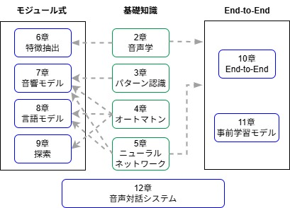

# イラストで学ぶ音声認識 改訂第 2 版

- 著者：荒木雅弘
- 出版社：講談社
- 出版年：2025 年
- 出版社の公式ホームページ：[https://www.kspub.co.jp/book/detail/5394779.html](https://www.kspub.co.jp/book/detail/5394779.html)
- 書影
  

## 章構成

## スライド

### 1. はじめに

<iframe src="https://www.docswell.com/slide/Z7R2VG/embed" allowfullscreen="true" class="docswell-iframe" width="620" height="406" style="border: 1px solid #ccc; display: block; margin: 0px auto; padding: 0px; aspect-ratio: 620/406;"></iframe>

### 2. 音声とは

<iframe src="https://www.docswell.com/slide/5J4DLX/embed" allowfullscreen="true" class="docswell-iframe" width="620" height="406" style="border: 1px solid #ccc; display: block; margin: 0px auto; padding: 0px; aspect-ratio: 620/406;"></iframe>

### 3. 統計的パターン認識

<iframe src="https://www.docswell.com/slide/54VGQJ/embed" allowfullscreen="true" class="docswell-iframe" width="620" height="406" style="border: 1px solid #ccc; display: block; margin: 0px auto; padding: 0px; aspect-ratio: 620/406;"></iframe>

### 4. 有限状態オートマトン

<iframe src="https://www.docswell.com/slide/KMXD16/embed" allowfullscreen="true" class="docswell-iframe" width="620" height="406" style="border: 1px solid #ccc; display: block; margin: 0px auto; padding: 0px; aspect-ratio: 620/406;"></iframe>

### 5. ニューラルネットワーク

<iframe src="https://www.docswell.com/slide/ZEXGN1/embed" allowfullscreen="true" class="docswell-iframe" width="620" height="406" style="border: 1px solid #ccc; display: block; margin: 0px auto; padding: 0px; aspect-ratio: 620/406;"></iframe>

### 6. 音声からの特徴抽出

<iframe src="https://www.docswell.com/slide/ZYDXW9/embed" allowfullscreen="true" class="docswell-iframe" width="620" height="406" style="border: 1px solid #ccc; display: block; margin: 0px auto; padding: 0px; aspect-ratio: 620/406;"></iframe>

### 7. 統計的音声認識：音響モデル

<iframe src="https://www.docswell.com/slide/5N1DRG/embed" allowfullscreen="true" class="docswell-iframe" width="620" height="406" style="border: 1px solid #ccc; display: block; margin: 0px auto; padding: 0px; aspect-ratio: 620/406;"></iframe>

### 8. 統計的音声認識：言語モデル

<iframe src="https://www.docswell.com/slide/Z6VRYL/embed" allowfullscreen="true" class="docswell-iframe" width="620" height="406" style="border: 1px solid #ccc; display: block; margin: 0px auto; padding: 0px; aspect-ratio: 620/406;"></iframe>

### 9. 統計的音声認識：探索

<iframe src="https://www.docswell.com/slide/ZV1DV2/embed" allowfullscreen="true" class="docswell-iframe" width="620" height="406" style="border: 1px solid #ccc; display: block; margin: 0px auto; padding: 0px; aspect-ratio: 620/406;"></iframe>

### 10. End-to-End の音声認識

<iframe src="https://www.docswell.com/slide/Z1R6JE/embed" allowfullscreen="true" class="docswell-iframe" width="620" height="406" style="border: 1px solid #ccc; display: block; margin: 0px auto; padding: 0px; aspect-ratio: 620/406;"></iframe>

### 11. 事前学習モデルによる音声認識

<iframe src="https://www.docswell.com/slide/5G1DX4/embed" allowfullscreen="true" class="docswell-iframe" width="620" height="406" style="border: 1px solid #ccc; display: block; margin: 0px auto; padding: 0px; aspect-ratio: 620/406;"></iframe>

### 12. 音声対話システム

<iframe src="https://www.docswell.com/slide/K9V38Y/embed" allowfullscreen="true" class="docswell-iframe" width="620" height="406" style="border: 1px solid #ccc; display: block; margin: 0px auto; padding: 0px; aspect-ratio: 620/406;"></iframe>
